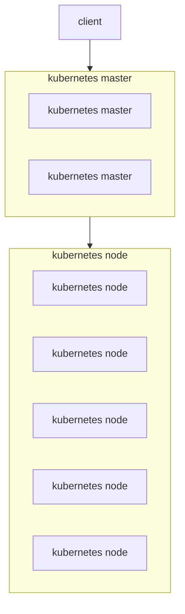

쿠버네티스는 쿠버네티스 마스터와 쿠버네티스 노드로 구성되어 있다  
- 쿠버네티스 마스터
  - API 엔드포인트 제공
  - 컨테이너 스케쥴링
  - 컨테이너 스케일링
  - 등등
- 쿠버네티스 노드
  -  컨테이너 가동 (컨테이너 호스트)

---

쿠버네티스가 취급하는 리소스는 크게 5가지 카테고리로 분류

|     종류     |           개요            |
|:----------:|:-----------------------:|
|    워크로드    |       컨테이너 실행 관련        |
|    서비스     | 컨테이너를 외부에 공개하는 엔드포인트 제공 |
| 컨피그 & 스토리지 |    설정/기밀정보/영구 볼륨 관련     |
|    클러스터    |        보안, 쿼터 관련        |
|   메타데이터    |   클러스터 내부의 다른 리소스를 관리   |

개발자는 주로 **워크로드, 서비스, 컨피그 & 스토리지** 리소스를 사용

- 워크로드
  - Pod
  - ReplicationController
  - ReplicaSet
  - Deployment
  - DaemonSet
  - StatefulSet
  - Job
  - CronJob
- 서비스
  - 서비스
    - ClusterIP
    - NodePort
    - LoadBalancer
    - Headless
    - ExternalName
  - 인그레스
- 컨피그&스토리지
  - Secret
  - ConfigMap
  - PersistentVolumeClaim
- 클러스터
  - Node
  - Namespace
  - PersistentVolume
  - ResourceQuota
  - ServiceAccount
  - Role
  - ClusterRole
  - RoleBinding
  - ClusterRoleBinding
  - NetworkPolicy
- 메타데이터
  - LimitRange
  - HorizontalPodAutoscaler(HPA)
  - PodDisruptionBudget(PDB)
  - CustomResourceDefinition

---

쿠버네티스에는 Namespace라고 불리는 가상적인 쿠버네티스 클러스터 분리 기능이 있다.  

기본 설정에서는 다음 네 가지 Namespace가 생성된다.

| Namespace       | Description                             |
|-----------------|-----------------------------------------|
| kube-system     | 쿠버네티스 클러스터 구성 요소와 애드온이 배포될 Namespace    |
| kube-pubilc     | 모든 사용자가 사용할 수 있는 컨피그맵 등을 배치하는 Namespace |
| kube-node-lease | 노드 하트비트 정보가 저장된 Namespace               |
| default         | 기본 Namespace                            |

RBAC(Role-Based Access Control)를 이용하여 Namespace별 클러스터 조작에 대한 권한을 구분할 수 있음

___

[kubectl 예제](kubectl.md)
