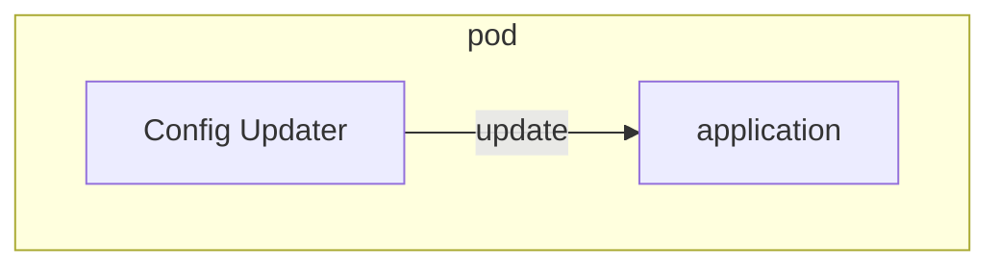
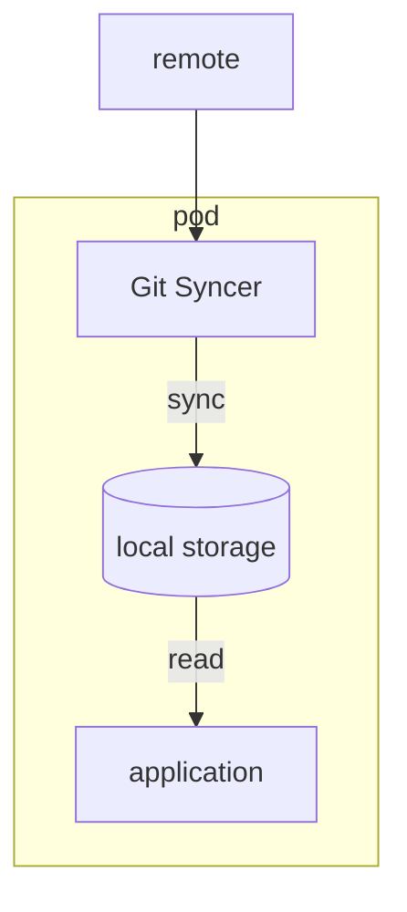
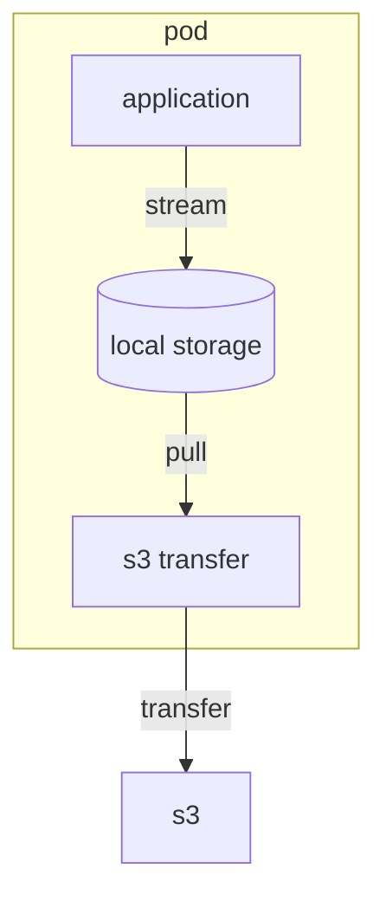
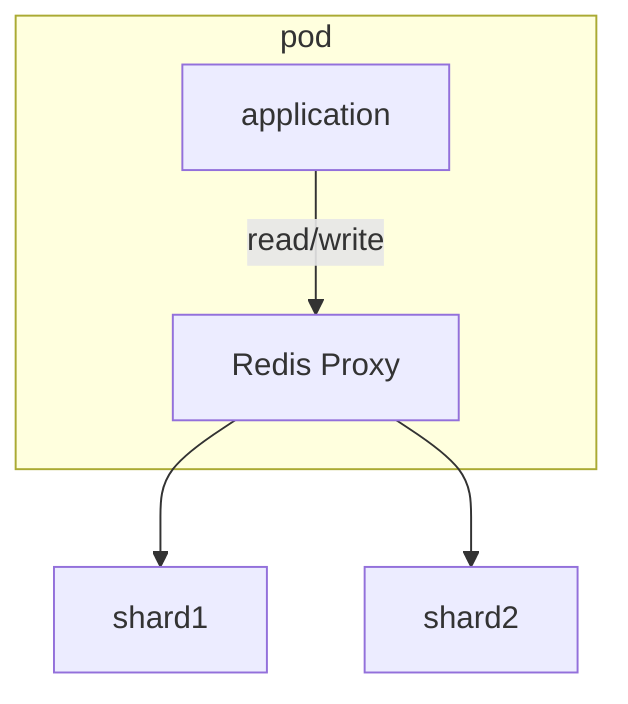
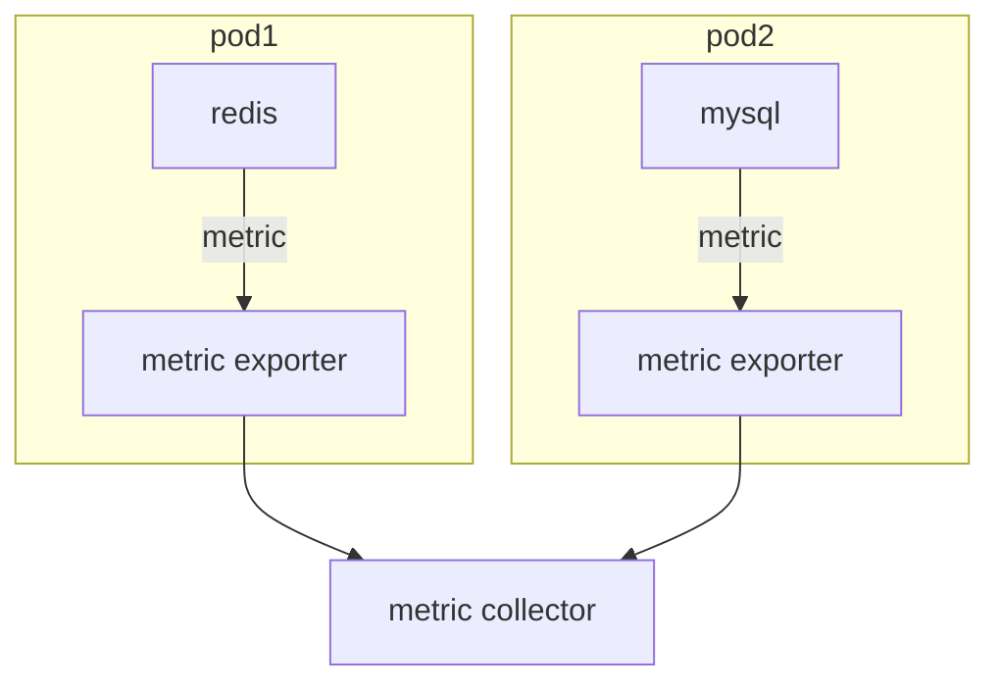

# 워크로드 API 카테고리

워크로드 API 카테고리로 분류된 리소스는 클러스터에 컨테이너를 기동시키기 위해 사용되는 리소스다.
내부에서 사용되는 리소스를 제외하고, 사용자가 직접 사용하는 리소스는 총 8가지 ([참고자료](https://kubernetes.io/ko/docs/concepts/workloads/))
- Pod
- Replication Controller (ReplicaSet의 레거시)
- ReplicaSet
- Deployment
- DaemonSet
- StatefulSet
- Job
- CronJob

**각 워크로드 API 카테고리로 분류된 리소스의 관계**  


## Pod
워크로드 리소스의 최소 단위는 Pod라고 불리는 리소스다.  
Pod는 한 개 이상의 컨테이너로 구성되며, 같은 Pod에 포함된 컨테이너끼리는 네트워크적으로 격리되어 있지 않고 IP 주소를 공유한다
> Pod 단위로 IP 주소 할당

### Pod 디자인 패턴

| 종류                 | 개요                 |
|--------------------|--------------------|
| sidecar pattern    | 메인 컨테이너에 기능을 추가    |
| ambassador pattern | 외부 시스템과의 통신을 중계    |
| adapter pattern    | 외부 접속을 위한 인터페이스 제공 |

#### sidecar pattern







#### ambassador pattern



#### adapter pattern


### Pod DNS 설정과 서비스 디스커버리

DNS Policy는 Pod 정의`spec.dnsPolicy`에 설정한다.

**dnsPolicy**설정값

| 설정값                     | 개요                                          |
|-------------------------|---------------------------------------------|
| ClusterFirst(default)   | 클러스터 내부 dns에 질의하여 해석되지 않으면 upstream에 질의     |
| None                    | Pod 정의 내에서 정적으로 설정                           |
| Default                 | Pod가 기동하는 쿠버네티스 노드의 /etc/resolve.conf를 상속받는다 |
| ClusterFirstWithHostNet | ClusterFirst의 동작과 같다(hostNetwork 사용 시 설정)   |

## ReplicaSet
ReplicaSet은 Pod의 레플리카를 생성하고 지정한 Pod수를 유지하는 리소스다

```shell
kubectl apply -f sample-rs.yaml
kubectl get rs -o wide
kubectl get pods -l app=sample-app -o wide
```

ReplicaSet에서는 노드나 Pod에 장애가 발생했을 때 지정한 Pod 수를 유지하기 위해 다른 노드에서 Pod를 기동시켜 주기 때문에 장애 시에도 많은 영향을 받지 않는다.

```shell
kubectl delete pod sample-rs-942cx
kubectl get pods -o wide

# rs 상세정보 조회 (pod 증감 이력을 확인할 수 있음)
kubectl describe rs sample-rs
```

ReplicaSet은 쿠버네티스가 Pod를 모니터링하여 Pod 수를 조정한다.  
모니터링은 특정 레이블을 가진 Pod 수를 계산하는 형태로 이루어진다.  
레플리카 수가 부족한 경우 매니페스트에 기술된 spec.template으로 Pod를 생성하고 레플리카 수가 많을 경우 레이블이 일치하는 Pod 중 하나를 삭제한다.

같은 레이블을 가진 Pod를 ReplicaSet 밖에서 생성하면?
```shell
kubectl apply -f sample-rs-pod.yaml
kubectl get po -l app=sample-app
kubectl describe rs sample-rs
```
RepliaceSet은 Pod를 초과하여 생성한 것으로 판단하고 네 개의 Pod 중 하나를 정지시킨다.  
상황에 따라 기존 Pod가 삭제될 수도 있으니 주의해야 함

### 스케일링

ReplicaSet 스케일링 방법에는 두 가지가 있다.
- manifest 수정 -> apply
- kubectl scale 명령어 사용

```shell
sed -i .back 's|replicas: 3|replicas: 4|' sample-rs.yaml
kubectl apply -f sample-rs.yaml

kubectl scale rs sample-rs --replicas 5
kubectl get rs sample-rs
```

### 일치성 기준 조건과 집합성 기준 조건

쿠버네티스에서 어떤 조건을 지정할 때는 아래 두 가지 방법이 있고 ReplicaSet외에 스케쥴링할 때도 이 조건 지정이 사용된다

| 조건     | 개요                                             |
|--------|------------------------------------------------|
| 일치성 기준 | 조건부에 일치 불일치(=, !=) 조건 지정                       |
| 집합성 기준 | 조건부에 일치 불일치 조건 지정과 집합(in, notin, exists) 조건 지정 |

## Deployment
Deployment는 여러 ReplicaSet을 관리하여 롤링 업데이트나 롤백 등을 구현하는 리소스다.  
Deployment가 ReplicaSet을 관리하고 ReplicaSet이 Pod를 관리하는 관계다.

다음과 같은 순서로 동작한다

1. 신규 ReplicaSet 생성
2. 신규 ReplicaSet의 레플리카 수를 단계적으로 늘림
3. 이전 ReplicaSet의 레플리카 수를 단계적으로 줄임
4. (2, 3) 반복
5. 이전 ReplicaSet은 레플리카 수를 0으로 유지

Deployment를 사용하면 신규 ReplicaSet에 컨테이너가 기동되었는지,
헬스 체크등을 확인하면서 전환 작업이 진행되며,
ReplicaSet의 이행 과정에서 Pod 수에 대한 상세한 지정도 가능하다

쿠버네티스에서 가장 권장하는 컨테이너 기동 방법으로 알려져 있다

```shell
# --record 옵션은 어떤 명령어를 실행하고 업데이트했는지 이력을 저장
kubectl apply -f sample-deployment.yaml
# 다음과 같은 waring message 확인
# Flag --record has been deprecated, --record will be removed in the future
# 대체 옵션은 찾지 못함
# 나중에 사용할 일 생기면 찾아보는 것으로

kubectl get deployments
kubectl get rs
kubectl get po
```
