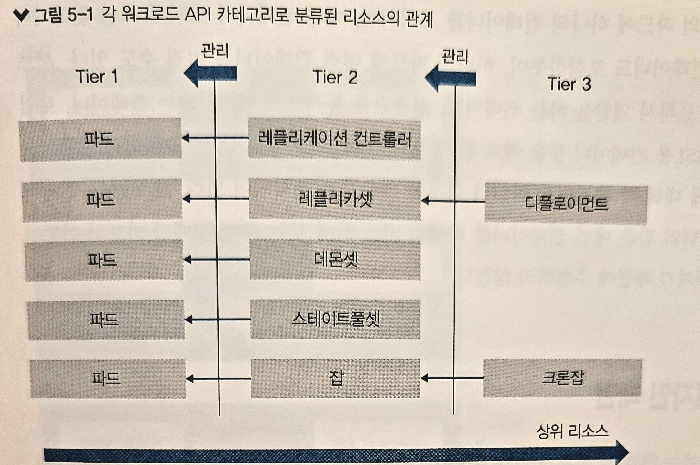
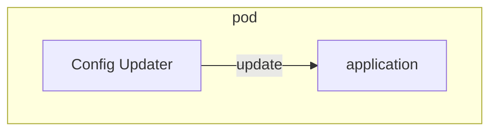
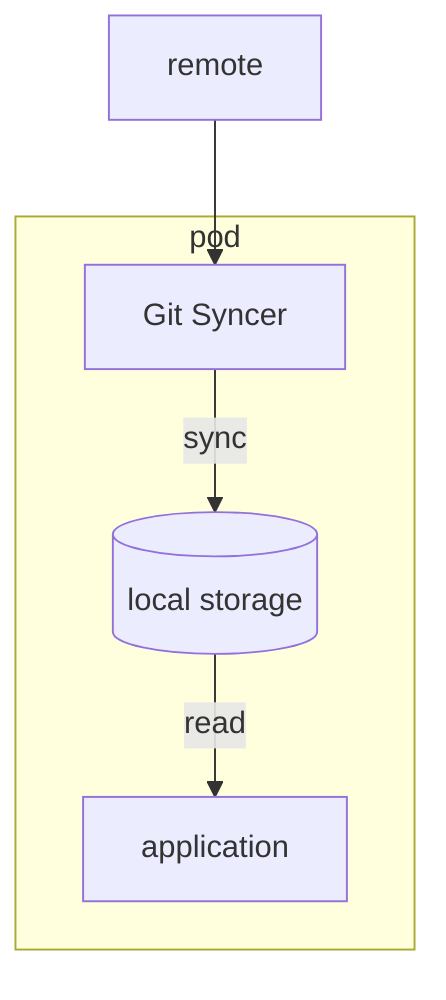
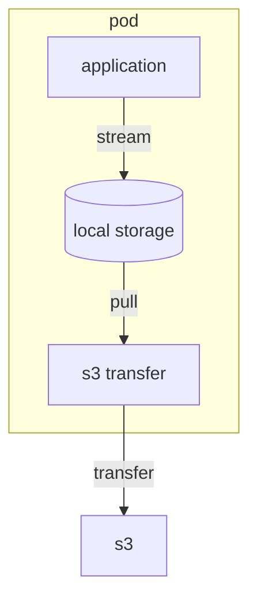
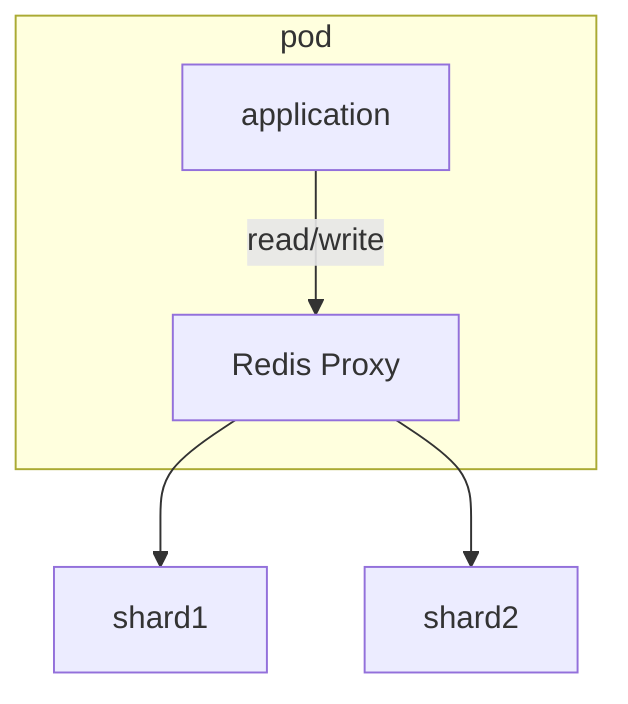
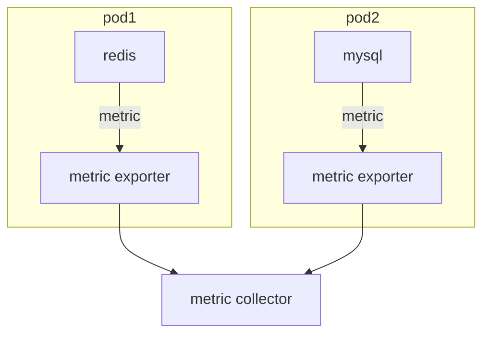
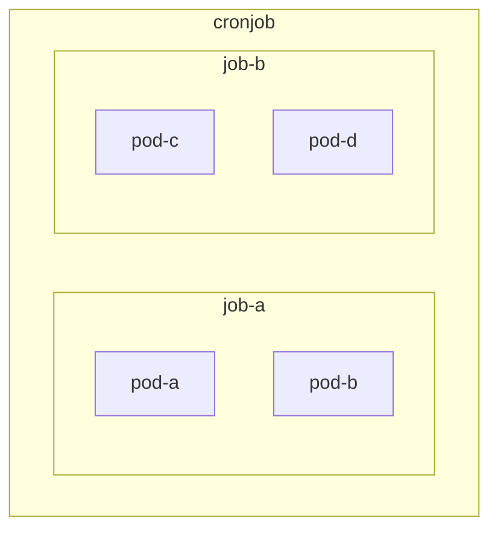

# 워크로드 API 카테고리

워크로드 API 카테고리로 분류된 리소스는 클러스터에 컨테이너를 기동시키기 위해 사용되는 리소스다.
내부에서 사용되는 리소스를 제외하고, 사용자가 직접 사용하는 리소스는 총 8가지 ([참고자료](https://kubernetes.io/ko/docs/concepts/workloads/))
- Pod
- Replication Controller (ReplicaSet의 레거시)
- ReplicaSet
- Deployment
- DaemonSet
- StatefulSet
- Job
- CronJob

**각 워크로드 API 카테고리로 분류된 리소스의 관계**  


## Pod
워크로드 리소스의 최소 단위는 Pod라고 불리는 리소스다.  
Pod는 한 개 이상의 컨테이너로 구성되며, 같은 Pod에 포함된 컨테이너끼리는 네트워크적으로 격리되어 있지 않고 IP 주소를 공유한다
> Pod 단위로 IP 주소 할당

### Pod 디자인 패턴

| 종류                 | 개요                 |
|--------------------|--------------------|
| sidecar pattern    | 메인 컨테이너에 기능을 추가    |
| ambassador pattern | 외부 시스템과의 통신을 중계    |
| adapter pattern    | 외부 접속을 위한 인터페이스 제공 |

#### sidecar pattern







#### ambassador pattern



#### adapter pattern


### Pod DNS 설정과 서비스 디스커버리

DNS Policy는 Pod 정의`spec.dnsPolicy`에 설정한다.

**dnsPolicy**설정값

| 설정값                     | 개요                                          |
|-------------------------|---------------------------------------------|
| ClusterFirst(default)   | 클러스터 내부 dns에 질의하여 해석되지 않으면 upstream에 질의     |
| None                    | Pod 정의 내에서 정적으로 설정                           |
| Default                 | Pod가 기동하는 쿠버네티스 노드의 /etc/resolve.conf를 상속받는다 |
| ClusterFirstWithHostNet | ClusterFirst의 동작과 같다(hostNetwork 사용 시 설정)   |

## ReplicaSet
ReplicaSet은 Pod의 레플리카를 생성하고 지정한 Pod수를 유지하는 리소스다

```shell
kubectl apply -f sample-rs.yaml
kubectl get rs -o wide
kubectl get pods -l app=sample-app -o wide
```

ReplicaSet에서는 노드나 Pod에 장애가 발생했을 때 지정한 Pod 수를 유지하기 위해 다른 노드에서 Pod를 기동시켜 주기 때문에 장애 시에도 많은 영향을 받지 않는다.

```shell
kubectl delete pod sample-rs-942cx
kubectl get pods -o wide

# rs 상세정보 조회 (pod 증감 이력을 확인할 수 있음)
kubectl describe rs sample-rs
```

ReplicaSet은 쿠버네티스가 Pod를 모니터링하여 Pod 수를 조정한다.  
모니터링은 특정 레이블을 가진 Pod 수를 계산하는 형태로 이루어진다.  
레플리카 수가 부족한 경우 매니페스트에 기술된 spec.template으로 Pod를 생성하고 레플리카 수가 많을 경우 레이블이 일치하는 Pod 중 하나를 삭제한다.

같은 레이블을 가진 Pod를 ReplicaSet 밖에서 생성하면?
```shell
kubectl apply -f sample-rs-pod.yaml
kubectl get po -l app=sample-app
kubectl describe rs sample-rs
```
RepliaceSet은 Pod를 초과하여 생성한 것으로 판단하고 네 개의 Pod 중 하나를 정지시킨다.  
상황에 따라 기존 Pod가 삭제될 수도 있으니 주의해야 함

### 스케일링

ReplicaSet 스케일링 방법에는 두 가지가 있다.
- manifest 수정 -> apply
- kubectl scale 명령어 사용

```shell
sed -i .back 's|replicas: 3|replicas: 4|' sample-rs.yaml
kubectl apply -f sample-rs.yaml

kubectl scale rs sample-rs --replicas 5
kubectl get rs sample-rs
```

### 일치성 기준 조건과 집합성 기준 조건

쿠버네티스에서 어떤 조건을 지정할 때는 아래 두 가지 방법이 있고 ReplicaSet외에 스케쥴링할 때도 이 조건 지정이 사용된다

| 조건     | 개요                                             |
|--------|------------------------------------------------|
| 일치성 기준 | 조건부에 일치 불일치(=, !=) 조건 지정                       |
| 집합성 기준 | 조건부에 일치 불일치 조건 지정과 집합(in, notin, exists) 조건 지정 |

## Deployment
Deployment는 여러 ReplicaSet을 관리하여 롤링 업데이트나 롤백 등을 구현하는 리소스다.  
Deployment가 ReplicaSet을 관리하고 ReplicaSet이 Pod를 관리하는 관계다.

다음과 같은 순서로 동작한다

1. 신규 ReplicaSet 생성
2. 신규 ReplicaSet의 레플리카 수를 단계적으로 늘림
3. 이전 ReplicaSet의 레플리카 수를 단계적으로 줄임
4. (2, 3) 반복
5. 이전 ReplicaSet은 레플리카 수를 0으로 유지

Deployment를 사용하면 신규 ReplicaSet에 컨테이너가 기동되었는지,
헬스 체크등을 확인하면서 전환 작업이 진행되며,
ReplicaSet의 이행 과정에서 Pod 수에 대한 상세한 지정도 가능하다

쿠버네티스에서 가장 권장하는 컨테이너 기동 방법으로 알려져 있다

```shell
# --record 옵션은 어떤 명령어를 실행하고 업데이트했는지 이력을 저장
kubectl apply -f sample-deployment.yaml
# 다음과 같은 waring message 확인
# Flag --record has been deprecated, --record will be removed in the future
# 대체 옵션은 찾지 못함
# 나중에 사용할 일 생기면 찾아보는 것으로

kubectl get deployments
kubectl get rs
kubectl get po

# 컨테이너 이미지 업데이트
kubectl set image deployment sample-deployment nginx-container=nginx:1.17 --record

# deployment 상태 확인
kubectl rollout status deployment sample-deployment

kubectl get rs
# 이전 버전의 ReplicaSet 의 레플리카 수가 0으로 변경 됨
```

deployment에서는 변경이 발생하면 레플리카셋이 생성된다.  
이 변경에는 레플리카 수의 변경 등은 포함되어 있지 않으며 생성된 파드의 내용변경이 필요하다 (spec.template 변경, Pod Template Hash)  
파드의 설정이 변경되면 ReplicaSet을 신규로 생성하고 롤링 업데이트를 하게 된다.  
수작업으로 이미지 등을 이전 버전으로 재변경하여 해시값이 동일해진 경우에는 ReplicaSet을 신규로 생성하지 않고 기존 ReplicaSet을 사용한다.

```shell
# 컨테이너 이미지 버전을 이전 상태로 수작업으로 변경 
kubectl set image deployment sample-deployment nginx-container=nginx:1.16 --record

kubectl get rs
# 이전 ReplicaSet 의 레플리카 수가 다시 3으로 변경 됨 (ReplicaSet을 새로 생성하지 않았음)
```

### 롤백

```shell
# 변경 이력 확인
kubectl rollout history deployment sample-deployment

# 버전 정보 확인 
kubectl rollout history deployment sample-deployment --revision 3

# 버전 번호를 지정하여 롤백
kubectl rollout undo deployment sample-deployment --to-revision 3

# 바로 이전 버전으로 롤백
kubectl rollout undo deployment sample-deployment
```

서비스 환경에서는 롤백 기능을 사용하는 경우가 많지 않다.  
이전 manifest 를 다시 kubectl apply 명령어로 적용하는 것이 호환성 면에서 더 좋다

### deployment 업데이트 일시 정지

상황에 따라서 deployment 업데이트를 지연시킬 수 있는 기능도 제공하고 있다

```shell
# 업데이트 일시 정지
kubectl rollout pause deployment sample-deployment

kubectl set image deployment sample-deployment nginx-container=nginx:latest --record
kubectl rollout status deployment sample-deployment

# 업데이트 일시 정지 해제
kubectl rollout resume deployment sample-deployment
```

### Deployment 업데이트 전략
`spec.strategy.type` 속성으로 업데이트 전략을 지정할 수 있다

- RollingUpdate (default)
- Recreate

#### Recreate
Recreate전략은 모든 Pod를 한 번 삭제하고 다시 Pod를 생성하기 때문에 다운타임이 발생하지만, 추가 리소스를 사용하지 않고 전환이 빠른 것이 장점이다

#### RollingUpdate
RollingUpdate는 업데이트 중에 동시에 정지 가능한 최대 Pod 수(maxUnavailable)와 업데이트 중에 동시에 생성할 수 있는 최대 Pod 수(maxSurge)를 설정할 수 있다.

```shell
kubectl apply -f sample-deployment-rollingupdate.yaml
kubectl set image deployment sample-deployment-rollingupdate nginx-container=nginx:1.17
kubectl get rs --watch
```

maxUnavailable과 maxSurge는 백분율로도 지정할 수 있다.
> 지정하지 않을 경우 기본값은 각각 25%로 지정된다

### 상세 업데이트 파라미터

- minReadySeconds (최소 대기 시간)
  - Pod가 Ready 상태가 된 다음부터 Deployment 리소스에서 Pod 기동이 완료되었다고 판단(다음 Pod 교체가 가능)하기까지의 최소 시간
- revisionHistoryLimit(수정 버전 기록 제한)
  - Deployment가 유지할 ReplicaSet 수
  - 롤백이 가능한 이력 수
- progressDeadlineSeconds(진행 기한)
  - Recreate/RollingUpdate 처리 타임아웃 시간
  - 타임아웃 발생 시 자동으로 롤백

## DaemonSet
DaemonSet은 ReplicaSet의 툭수한 형태라고 할 수 있는 리소스다. ReplicaSet은 각 쿠버네티스 노드에 총 N개의 파드를 노드의 리소스 상황에 맞게 배치하기에 
각 노드의 파드 수가 동일하다고 할 수 없으며, 모든 노드에 반드시 배치된다고도 할 수 없다.  

- DaemonSet은 각 노드에 Pod를 하나씩 배치하는 리소스다.
  - nodeSelector, nodeAntiAffinity를 사용한 스케쥴링으로 예외 처리는 가능하다
- DaemonSet은 레플리카 수를 지정할 수 없다
- DaemonSet은 하나의 노드에 2 개의 Pod를 배치할 수도 없다

각 Pod가 출력하는 로그를 호스트 단위로 수집하는 Fluented나 각 Pod리소스 사용 현황 및 노드 상태를 모니터링하는 Datadog등 모든 노드에서 반드시 동작해야 하는 프로세스에 적합하다

```shell
kubectl apply -f sample-ds.yaml

kubectl get po -o wide
# local 쿠버네티스 환경을 minikube 로 구성하였음 
# 노드 증설 1 -> 3
minikube add node
minikube add node
kubectl get po -o wide
```

### 업데이트 전략

- RollingUpdate (default)
- OnDelete

#### OnDelete
manifest가 수정되더라도 기존 Pod는 업데이트되지 않는다

임의의 시점에 Pod를 업데이트하는 경우에는 DaemonSet과 연결된 Pod를 `kubectl delete pod` 명령어로 수동으로 정지시키고 자동화된 복구 기능으로 새로운 파드를 생성해야 한다

```shell
kubectl apply -f sample-ds-on-delete.yaml
kubectl set image ds sample-ds-on-delete nginx-container=nginx:1.17
kubectl delete po sample-ds-on-delete-6twxs
kubectl describe ds sample-ds-on-delete
```

## StatefulSet
DaemonSet과 마찬가지로 ReplicaSet의 특수한 형태라고 할 수 있는 리소스  
데이터베이스 등과 같은 Stateful한 워크로드에 사용하기 위한 리소스다.

ReplicaSet과 비교하여 주된 차이점은 다음과 같다
- 생성되는 Pod명의 접미사는 숫자 인덱스가 부여된 것이다.
  - sample-statefulset-0, sample-statefulset-1, ...,sample-statefulset-N
  - Pod명이 바뀌지 않는다
- 데이터를 영구적으로 저장하기 위한 구조로 되어 있다.
  - PersistentVolume을 사용하는 경우에는 Pod를 재기동할 때 같은 디스크를 사용하여 다시 생성한다.

StatefulSet에서는 `spec.volumeClaimTemplates` 속성으로 StatefulSet의 각 Pod에 영구 볼륨 클레임을 설정할 수 있다.  
영구 볼륨 클레임을 사용하면 클러스터 외부의 네트워크를 통해 제공되는 영구 볼륨을 Pod에 연결할 수 있으므로, Pod를 재기동할 때나 다른 노드로 이동할 때 같은 데이터를 보유한 상태로 컨테이너가 다시 생성된다.  
영구 볼륨은 하나의 Pod가 소유할 수도 있고, 영구 볼륨의 종류에 따라 여러 Pod에서 공유할 수도 있다

```shell
kubectl apply -f sample-stateful-set.yaml
kubectl get statefulsets
kubectl get po -o wide
kubectl get persistentvolumeclaim
kubectl get persistentvolume
```

### 스케일링
ReplicaSet과 동일한 방법으로 스케일링할 수 있다.
ReplicaSet과 달리 기본적으로 Pod를 동시에 하나씩만 생성하고 삭제한다
> `spec.podManagementPolicy` 설정을 이용하여 Pod를 병렬로 생성할 지 순서대로 생성할 지 지정할 수 있다  
> 기본값은 OrderedReady

- 스케일 아웃일 때는 인덱스가 가장 작은 것부터 Pod를 하나씩 생성한다
- 스케일 인일 때는 인덱스가 가장 큰 Pod(가장 최근에 생성된 컨테이너)부터 삭제된다.

ReplicaSet의 경우 Pod가 무작위로 삭제되기 때문에 특정 Pod가 마스터가 되는 애플리케이션에는 부적합하다.
그러나 StatefulSet은 0번째 Pod가 항상 가장 먼저 생성되고 가장 늦게 삭제되기 때문에 0번째 Pod를 마스터 노드로 사용하는 이중화 구조 애플리케이션에 적합하다.

### 업데이트 전략

DaemonSet과 동일

#### RollinUpdate

- 영속성 데이터가 있으므로 추가 파드를 생성하는 롤링 업데이트 불가
- maxUnavailable 지정 불가
- Pod마다 Ready 상태인지 확인하며 업데이트 진행
- `spec.podManagementPolicy` 속성이 `Parallel`로 설정된 경우에도 병렬로 처리되지 않음
- `spec.rollingUpdate.partition` 속성을 이용하여 부분적 업데이트를 진행할 수 있음
  - 수동으로 재기동한 경우에도 `partition` 값보다 **작은 인덱스를 가진 파드는 업데이트되지 않음**

```shell
kubectl apply -f sample-stateful-set-rollingupdate.yaml
kubectl set image statefulset sample-stateful-set-rollingupdate nginx-container=nginx:1.17
kubectl get pods --watch
kubectl get pods -o custom-columns="NAME:{.metadata.name}, containers:{.spec.containers[].image}"
# 4,5 pod만 업데이트 됨 
```

```shell
kubectl exec -it sample-stateful-set-0 -- touch /usr/share/nginx/html/sample.html

# pod 삭제
kubectl delete po sample-stateful-set-0

kubectl exec -it sample-stateful-set-0 -- ls /usr/share/nginx/html
# 파일 유실 없음
```

- StatefulSet을 생성하면서 확보한 영구 볼륨은 StatefulSet이 삭제되어도 동시에 해제되지 않는다
- StatefulSet이 확보한 영구 볼륨을 해제하지 않고 다시 StatefulSet을 생성한 경우 영구 볼륨 데이터 그대로 pod가 기동된다

```shell
kubectl delete statefulset sample-stateful-set

kubectl get persistentvolumeclaims
kubectl get persistentvolumes

kubectl apply -f sample-stateful-set.yaml

kubectl exec -it sample-stateful-set-0 -- ls /usr/share/nginx/html
# 파일 유실 없음

kubectl delete statefulset sample-stateful-set

# statefulset이 확보한 영구 볼륨 해제
kubectl delete persistentvolumeclaims www-sample-stateful-set-{0..2}
```

## Job
Job은 컨테이너를 사용하며 한 번만 실행되는 리소스다  
N 개의 병렬로 실행하면서 지정된 횟수의 컨테이너 실행을 보장한다

pod의 정지가 정상 종료인 작업에 적합 (rsync, upload, ...)

```shell
kubectl apply -f sample-job.yaml
kubectl get po --watch
kubectl get jobs -o wide
```

디테일은 생략 (필요할 때 찾는걸로)

## CronJob

CronJob이 Job을 관리하고 Job이 파드를 관리하는 3계층 구조



디테일은 생략 (필요할 때 찾는걸로)
