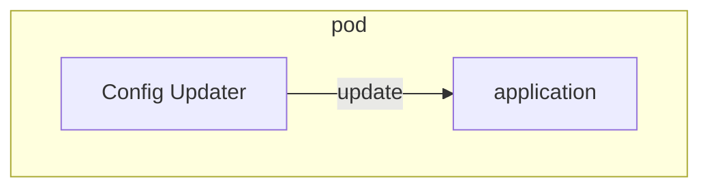
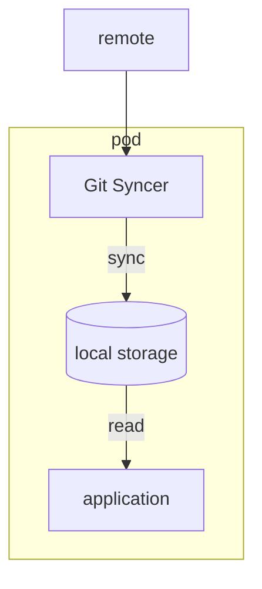
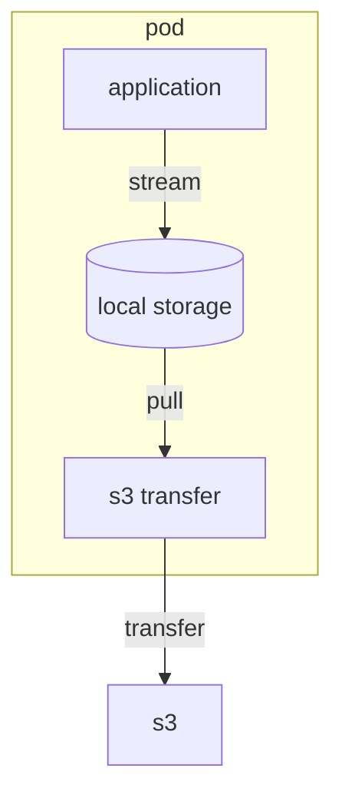
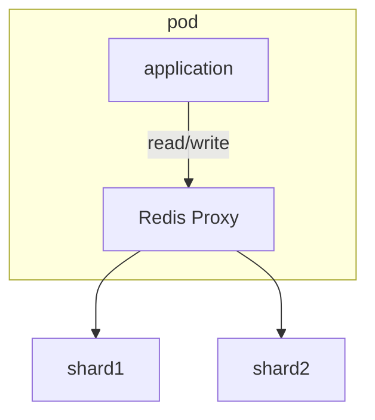
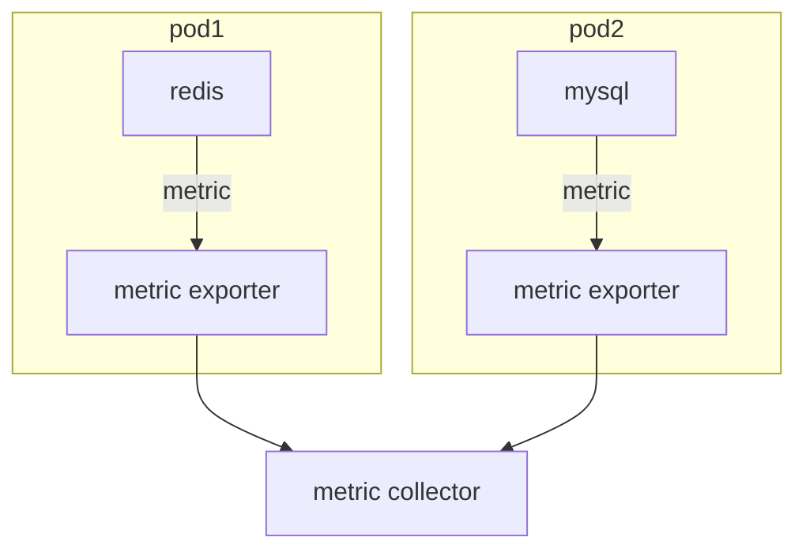

# 워크로드 API 카테고리

워크로드 API 카테고리로 분류된 리소스는 클러스터에 컨테이너를 기동시키기 위해 사용되는 리소스다.
내부에서 사용되는 리소스를 제외하고, 사용자가 직접 사용하는 리소스는 총 8가지 ([참고자료](https://kubernetes.io/ko/docs/concepts/workloads/))
- Pod
- Replication Controller (ReplicaSet의 레거시)
- ReplicaSet
- Deployment
- DaemonSet
- StatefulSet
- Job
- CronJob

**각 워크로드 API 카테고리로 분류된 리소스의 관계**  

## Pod
워크로드 리소스의 최소 단위는 Pod라고 불리는 리소스다.  
Pod는 한 개 이상의 컨테이너로 구성되며, 같은 Pod에 포함된 컨테이너끼리는 네트워크적으로 격리되어 있지 않고 IP 주소를 공유한다
> 파드 단위로 IP 주소 할당

### 파드 디자인 패턴

| 종류                 | 개요                 |
|--------------------|--------------------|
| sidecar pattern    | 메인 컨테이너에 기능을 추가    |
| ambassador pattern | 외부 시스템과의 통신을 중계    |
| adapter pattern    | 외부 접속을 위한 인터페이스 제공 |

#### sidecar pattern

#### ambassador pattern

#### adapter pattern

### 파드 DNS 설정과 서비스 디스커버리

DNS Policy는 파드 정의`spec.dnsPolicy`에 설정한다.

**dnsPolicy**설정값

| 설정값                     | 개요                                          |
|-------------------------|---------------------------------------------|
| ClusterFirst(default)   | 클러스터 내부 dns에 질의하여 해석되지 않으면 upstream에 질의     |
| None                    | 파드 정의 내에서 정적으로 설정                           |
| Default                 | 파드가 기동하는 쿠버네티스 노드의 /etc/resolve.conf를 상속받는다 |
| ClusterFirstWithHostNet | ClusterFirst의 동작과 같다(hostNetwork 사용 시 설정)   |

## ReplicaSet
ReplicaSet은 파드의 레플리카를 생성하고 지정한 파드수를 유지하는 리소스다
