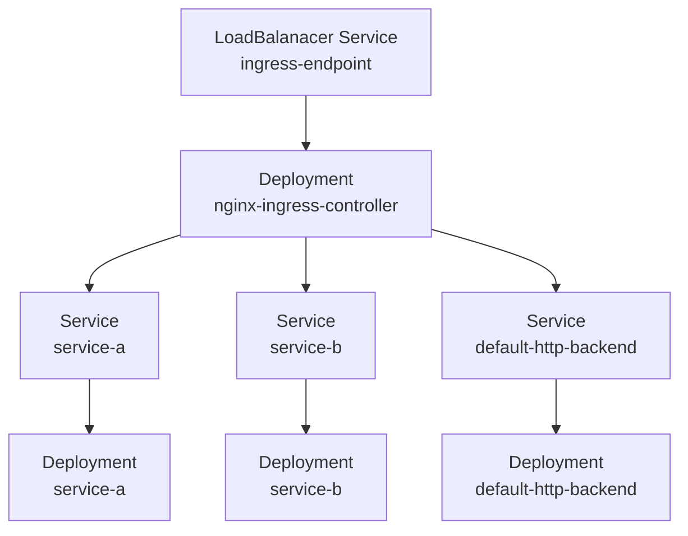

# 서비스 API 카테고리

## ClusterIP

- 로드 밸런서
- 클러스터 내부에서만 접속 가능
- ExternalIP 옵션으로 특정 쿠버네티스 노드로 들어오는 요청을 수신할 수 있음 (외부 수신)

```shell
kubectl apply -f sample-deployment.yaml
kubectl apply -f sample-cluster-ip.yaml

# Pod internal IP 확인 
kubectl get po -l app=sample-app -o custom-columns="NAME:{metadata.name}, IP:{status.podIP}"

# ClusterIP 에 연결된 엔드포인트 확인
kubectl describe svc sample-cluster-ip | grep -i Endpoints
```

## NodePort

모든 쿠버네티스 노드에서 수신한 요청을 컨테이너에 전송하는 형태로 외부와 통신이 가능하게 한다  
0.0.0.0:포트를 사용하여 모든 IP 주소로 바인드하는 형태

```shell
kubectl apply -f sample-nodeport.yaml
kubectl get svc
```

## LoadBalancer

- 쿠버네티스 클러스터 외부의 로드 밸런서에 외부 통신이 가능한 가상ip를 할당
- 쿠버티스 노드와 별도로 외부 로드 밸런서를 사용하기 때문에 노드 장애와 로드 밸런서와 격리
> NodePort, ExternalIP 에서는 쿠버네티스 노드에 할당된 IP 주소로 통신을 하기 때문에 노드가 SPoF가 된다

## ExternalName
서비스명으로 임의의 CNAME을 반환

## HeadlessService

- HeadlessService는 대상이 되는 개별 파드의 IP 주소가 직접 반환된다
- 로드밸런싱을 위한 엔드포인트(IP 주소)가 제공되지 않는다
- DNS 라운드 로빈을 사용한 엔드포인트를 제공한다
  - 클러스터 내부 DNS 에서 반환되는 형태로 부하 분산을 하기 때문에 클라이언트에서 DNS 캐시에 주의해야 한다

```shell
kubectl apply -f sample-headless.yaml


kubectl run --image=amsy810/tools:v2.0 --restart=Never --rm -i testpod \ 
--command -- dig sample-headless.default.svc.cluster.local

kubectl run --image=amsy810/tools:v2.0 --restart=Never --rm -i testpod \
--command -- dig sample-stateful-set-headless-0.sample-headless.default.svc.cluster.local

kubectl apply -f sample-subdomain.yaml

kubectl run --image=amsy810/tools:v2.0 --restart=Never --rm -i testpod \
--command -- dig sample-hostname.sample-subdomain.default.svc.cluster.local
```

## None-Selector Service

서비스명으로 이름 해석을 하면 자신이 설정한 멤버에 대해 로드 밸런싱을 한다

```shell
kubectl apply -f sample-none-selector.yaml

kubectl run --image=amsy810/tools:v2.0 --restart=Never --rm -i testpod \
--command -- dig sample-none-selector
```
흠.........

## Ingress

Ingress는 L7 로드 밸런싱을 제공하는 리소스다
> 지금까지 배운 로드 밸런싱은 L4

- 인그레스 리소스 생성
- 인그레스 컨트롤러는 설정에 따라 L7 로드 밸런서 생성
- 인그레스 컨트롤러는 인그레스 리소스의 변경을 감시

인그레스의 구현체는 여러가지 ([참고자료](https://kubernetes.io/ko/docs/concepts/services-networking/ingress-controllers/))
> 어떤 L7 로드 밸런서를 생성할지는 인그레스 컨트롤러에 따라 달라진다

인그레스는 크게 두 가지로 분류된다
- 클러스터 외부 로드 밸런서를 사용한 인그레스
- 클러스터 내부 인그레스용 파드를 배포하는 인그레스
  - 인그레스 파드에 대해 클러스터 외부에서 접속할 수 았도록 별도로 인그레스용 파드에 LoadBalancer 서비스 생성 필요
  - 부하에 따른 오토 스케일링 고려

**Nginx 인그레스 컨트롤러 구성**


실습을 진행하기 전에 먼저 [이 문서](https://github.com/kubernetes/ingress-nginx/blob/main/docs/deploy/index.md)를 확인하여 환경에 맞게 nginx 인그레스 컨트롤러를 설치

```shell
# 인그레스 리소스를 생성하려면 서비스 백엔드가 생성되어 있어야 함
# 동작 테스트를 위해 파드도 생성
kubectl apply -f sample-ingress-apps.yaml

# 인증서 생성
openssl req -x509 -nodes -days 365 -newkey rsa:2048 \
-keyout ~/tls.key -out ~/tls.crt -subj "/CN=sample.example.com"
# 시크릿 생성
kubectl create secret tls --save-config tls-sample --key ~/tls.key --cert ~/tls.crt

# 인그레스 리소스 생성
kubectl apply -f sample-ingress-by-nginx.yaml

# 인그레스 리소스 목록 확인
kubectl get ingress

kubectl get svc -n ingress-nginx

kubectl port-forward --namespace=ingress-nginx service/ingress-nginx-controller 8080:80
curl http://localhost:8080/path1 -H "Host: sample.example.com"
curl http://localhost:8080/path2 -H "Host: sample.example.com"
```
